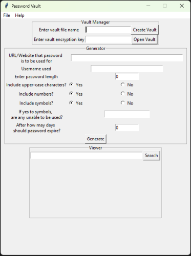
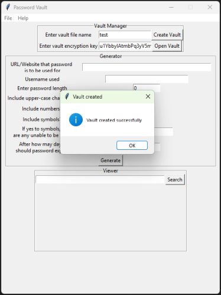
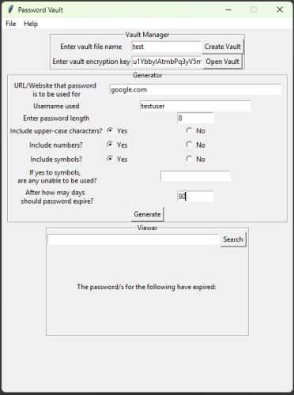
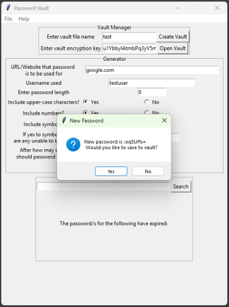
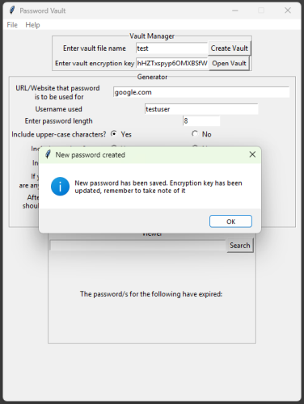
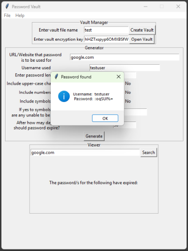
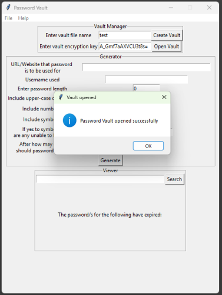
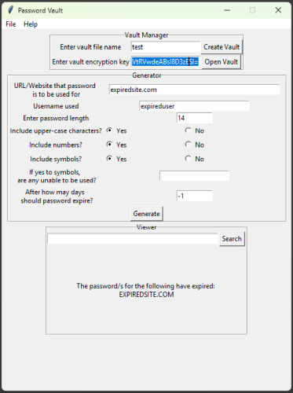
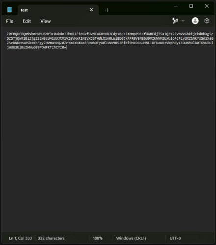

# The Original Project

Back when I first learned Python, I built a password vault as a passion project. It used a Tkinter gui, was able to generate and store passwords along with the matching username and website. 
Passwords encryption is handled with Fernet, using AES128 in CBC mode for encryption and HMAC with SHA256 for authentication.

## Use

1. User creates vault by specifying a unique name and selecting 'Create Vault' (image 2)
2. Message box is shown with 'Vault created successfully'. An encryption key is generated and provided for the vault. In the example, key is u1YbbyIAtmbPq3yV5mAeMQD6yCFelxZoVy8IyiZjeZg= (image 3)
3. User is able to then generate a password. Available variables are website, username, password length, uppercase characters, numbers, symbols, disallowed symbols and expiry period (image 4)
4. Message box is shown presenting user with generated password, and asks whether the password should be saved to vault (image 5)
5. Upon save, user is notified so and is reminded to take not of the refreshed encryption key hHZTxspyp6OMXBSfWSJ-FO-g2d2A_Gmf7aAXVCU3t8s= (image 6)
6. The user can now enter the website into the search box of the 'Viewer' section. If a matching entry is found, a message is displayed showing the username and password (image 7)
7. When the vault is closed and reopened, the user enters the vault name and the most recently provided decryption key to access their vault (image 8)
8. If one of the users passwords have expired, this is shown upon accessing the vault (image 9)

## Shortcomings

The main downfall of this project is its reliance on Tkinter for production of the GUI. While a useful tool for prototyping, it is undeniably dated.

As far as the encryption goes, AES256 in GCM mode would have been a better choice dues to its built-in integrity checking functionality as well as the stronger encryption a longer key provides.

Relicance on a randomly generated key is another weak point, as this relies on the user keeping track of a long and unwieldy character string in order to maintain their access to the vault.

## Images

    
    
    

    
    
    

    
    
    

    

